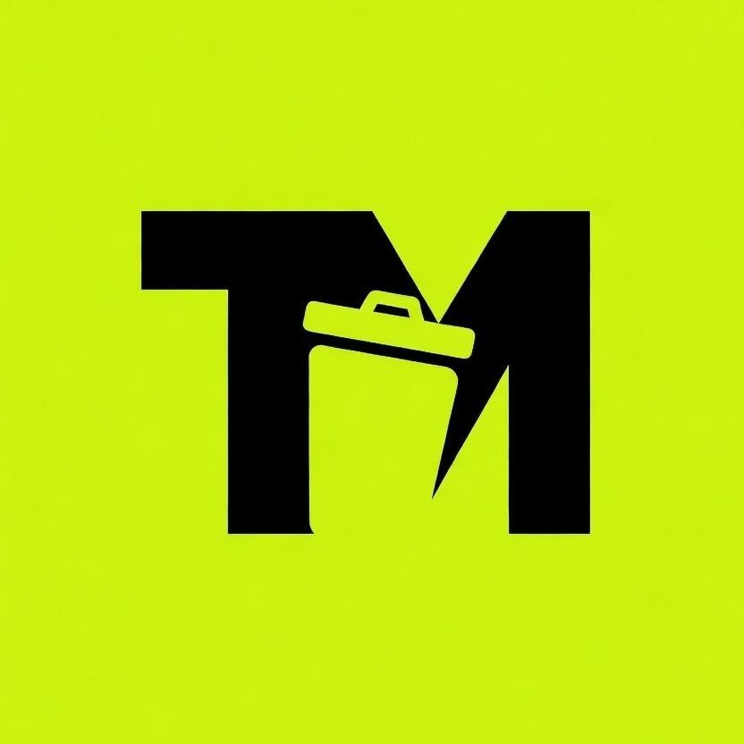

# Trashmarket.fun

  
  
  # TRASHMARKET.FUN
  
  ### The Premier Marketplace & DeFi Hub for the Gorbagana Chain
  
  
  
   
  
  **Discover NFTs. Trade GorIDs. Swap Tokens. Engage in On-Chain Games. Bridge Assets.**
  **All within the Gorbagana Ecosystem.**
  
   

---

## Overview

Trashmarket.fun is an innovative all-in-one decentralized application (dApp) meticulously crafted for the Gorbagana ecosystem, a high-performance Solana-compatible Layer 2 blockchain. It seamlessly integrates a robust NFT marketplace, a decentralized exchange (DEX), a trustless peer-to-peer token bridge, engaging on-chain games, and a dynamic GorID trading platform. The platform is designed with a brutalist, terminal-inspired interface, reflecting Gorbagana's unique blend of technical precision and irreverent trash aesthetic.

---

## Key Features

Trashmarket.fun offers a comprehensive suite of features to enhance your experience on the Gorbagana chain:

*   **NFT Marketplace**: Explore, acquire, and manage NFT collections on Gorbagana. Benefit from real-time activity feeds, floor price analytics, and detailed collection statistics.
*   **DEX / Token Swap**: Execute direct token trades on Gorbagana through our integrated decentralized exchange, ensuring efficient and secure asset swaps.
*   **P2P OTC Bridge**: **(Under Construction)** Facilitate trustless peer-to-peer cross-chain asset transfers between **sGOR** (SPL token on Solana) and **gGOR** (native gas on Gorbagana) via an on-chain escrow order book. This system ensures atomic settlement without custodians or asset wrapping.
*   **GorID Domains**: Register and trade unique **.gor** domain names. Easily look up addresses, browse available domains, or list your own for sale.
*   **On-Chain Games**:
    *   **JunkPusher**: A captivating coin-pusher style game featuring DEBRIS token deposits and on-chain verified winnings.
    *   **Slots**: **(Under Construction)** A skill-based slot game designed with memory bonus rounds for an engaging gaming experience.
*   **Vanity Address Generator**: Generate custom Gorbagana wallet addresses with your preferred prefixes or suffixes, powered by efficient in-browser web workers.
*   **Raffle System**: Participate in or create transparent on-chain NFT raffles with verifiable winner selection mechanisms.
*   **Collection Submissions**: Submit your NFT collections for listing on the marketplace and track their approval status.

---

## Security & Privacy

At Trashmarket.fun, user security and privacy are paramount. We adhere to a strict client-side private key management policy:

> **All private keys are kept client-side.** This means that Trashmarket.fun does not store, transmit, or have any access to your private keys. Your keys remain entirely under your control, residing securely within your browser or connected wallet. This architecture significantly enhances security by minimizing the risk of server-side breaches affecting your digital assets. Users are solely responsible for the safekeeping and management of their private keys, which are essential for authorizing all blockchain transactions.

---

## Network Information

| Attribute           | Detail                                    |
| :------------------ | :---------------------------------------- |
| **Chain**           | Gorbagana (Solana-compatible L2)          |
| **RPC Endpoint**    | `https://rpc.trashscan.io`                |
| **Block Explorer**  | [trashscan.io](https://trashscan.io)      |
| **Native Token**    | gGOR                                      |
| **SPL Token (Solana)** | sGOR                                      |

---

## Support Development

Your support is invaluable in bootstrapping the continuous development and innovation of Trashmarket.fun. Consider contributing to our efforts:

**Solana Wallet Address:**
`Hn1i7bLb7oHpAL5AoyGvkn7YgwmWrVTbVsjXA1LYnELo`

or **mattrick.sol**

---

## License

All rights reserved. This is proprietary software. Unauthorized copying, modification, distribution, or use of this software is strictly prohibited.
