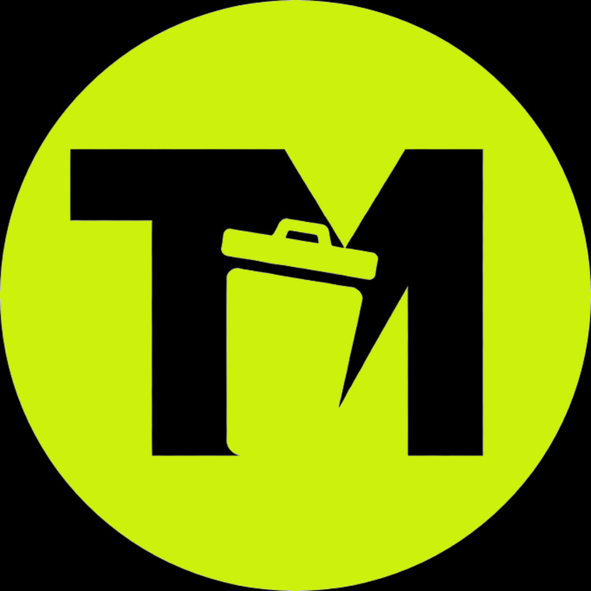

# TRASHMARKET.FUN

### The Marketplace & DeFi Hub for the Gorbagana Chain

 

**Browse NFTs. Trade GorIDs. Swap tokens. Play games. Bridge assets.**
**All on Gorbagana.**

 

---

## What is Trashmarket?

Trashmarket is an all-in-one platform for the Gorbagana ecosystem — a Solana-compatible L2 chain. It combines an NFT marketplace, a DEX, a trustless P2P token bridge, on-chain games, and a GorID trading platform into a single brutalist, terminal-inspired interface.

---

## Features

### NFT Marketplace
Browse, buy, and sweep NFT collections on Gorbagana. Live activity feeds, floor price charts, and collection-level stats — all in real time.

### DEX / Token Swap
Trade tokens directly on Gorbagana with a built-in decentralized exchange.

### P2P OTC Bridge
Swap between **sGOR** (SPL token on Solana) and **gGOR** (native gas on Gorbagana) through a fully on-chain escrow order book. No custodians, no wrapping — just atomic peer-to-peer settlement.

### GorID Domains
Register and trade **.gor** domain names. Look up any address, browse listed domains, or list your own for sale.

### On-Chain Games
- **JunkPusher** — A coin-pusher style game with DEBRIS token deposits and on-chain verified winnings.
- **Slots** — A skill-based slot game with memory bonus rounds.

### Vanity Address Generator
Mine custom Gorbagana wallet addresses with your preferred prefix or suffix, powered by in-browser web workers.

### Raffle System
Create and participate in on-chain NFT raffles with transparent winner selection.

### Collection Submissions
Submit your own NFT collection to be listed on the marketplace. Track your submission status from pending to approved.

---

## Bridge Architecture

The bridge uses **dual-program escrow architecture** for trustless P2P cross-chain trading between Solana and Gorbagana.

| Chain | Token | Description |
|-------|-------|-------------|
| **Gorbagana** | gGOR (native, 9 decimals) | Native gas token |
| **Solana** | sGOR (SPL, 6 decimals) | Wrapped SPL token |

### Trading Flow

| Direction | Step 1 | Step 2 | Step 3 |
|-----------|--------|--------|--------|
| **sGOR → gGOR** | Maker locks sGOR on Solana | Taker locks gGOR on Gorbagana | Atomic settlement |
| **gGOR → sGOR** | Maker locks gGOR on Gorbagana | Taker locks sGOR on Solana | Atomic settlement |

> Each blockchain has its own escrow program. Cross-chain coordination ensures both sides settle atomically.

---

## Network Info

| | |
|-|-|
| **Chain** | Gorbagana (Solana-compatible L2) |
| **RPC** | `https://rpc.trashscan.io` |
| **Explorer** | [trashscan.io](https://trashscan.io) |
| **Native Token** | gGOR |
| **SPL Token (on Solana)** | sGOR |

---

## Support Development

Want to help bootstrap progress?

**Solana Wallet Address:**
`Hn1i7bLb7oHpAL5AoyGvkn7YgwmWrVTbVsjXA1LYnELo`

or **mattrick.sol**

---

## License

All rights reserved. This is proprietary software. Unauthorized copying, modification, distribution, or use of this software is strictly prohibited.

